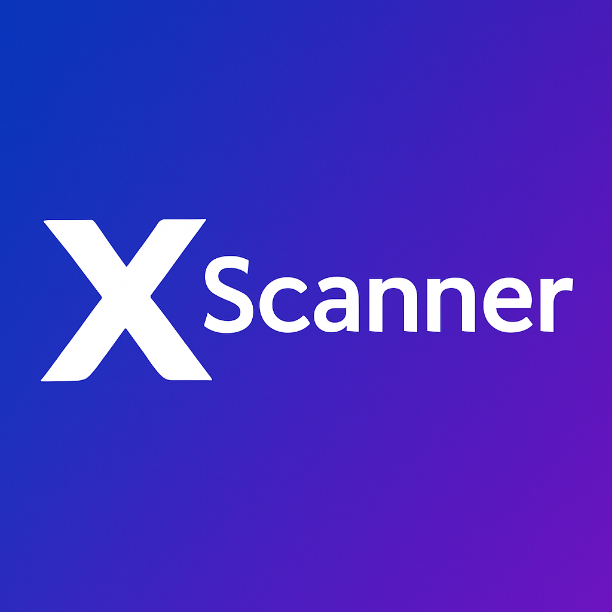

<div align="center">


# RS Apps Studio

**Safe, secure and user-friendly mobile and web utilities**

by **RS KUSUM** · Android & Web Developer

[](https://www.rsappsstudio.com)
[](mailto:rskusum@rsappsstudio.com)
[](https://play.google.com/store/apps/details?id=com.rskusum.xscanner)

</div>

---

## 👋 About

I'm **RS KUSUM**. I've been building Android apps and websites for **more than two years**, and I publish them under the **RS Apps Studio** name.

I focus on everyday tools that are fast, private and easy to use:
- Apps do their work **on the device** wherever possible.
- They ask only for the **permissions they actually need**.
- They're designed so **anyone can use them without a manual**.

**What I work with:**


---

## 📱 Apps on Google Play

<table>
<tr>
<td align="center" width="33%">
<br/>
<b>XScanner – PDF Scanner</b><br/>
<sub>Document scanning, PDF creation, text extraction and PDF tools</sub><br/><br/>
<a href="https://play.google.com/store/apps/details?id=com.rskusum.xscanner"></a>
</td>
<td align="center" width="33%">
<b>HydroSonic</b><br/>
<sub><code>com.rskusum.hydrosonic</code></sub><br/><br/>
<a href="https://play.google.com/store/apps/details?id=com.rskusum.hydrosonic"></a>
</td>
<td align="center" width="33%">
<b>EMI Calculator</b><br/>
<sub><code>com.rskusum.emicalculator</code></sub><br/><br/>
<a href="https://play.google.com/store/apps/details?id=com.rskusum.emicalculator"></a>
</td>
</tr>
</table>

### 🚧 In the pipeline

| App | Status |
|---|---|
| **Try Fit** | In development |
| **Smart Printer** | In development |
| …and more utilities | Planned |

---

## 🧩 Open source: RS Kusum Scanner SDK

[](https://jitpack.io/#newsworldrs/rsappsstudio.github.io)
[](https://github.com/newsworldrs/rsappsstudio.github.io/actions/workflows/scanner-android.yml)
[](scanner-android/LICENSE)


This is a complete **Android document scanner library**, which you can use free in both free and commercial apps. It works fully on the device, with no ML Kit, Play services or cloud.

- 📷 **Auto capture** of the page, with **precise auto crop** from on-device edge detection and perspective correction.
- 📚 **Scan modes:** Document, Book (the two pages are split at the spine), Book cover, Whiteboard, ID card (front and back on one page) and Business card.
- 🔄 **Upright pages:** an on-device text-orientation model turns sideways or upside-down pages the right way up.
- ✨ **Editing:** filters (Auto colour, No shadow, B&W…), an **eraser** that can remove marks and keep the text, crop and rotate.
- 🔤 **AI Text:** live text highlighting in the camera, **on-device OCR** with Tesseract (100+ languages), plus the document type and key details (links, phone numbers, dates, amounts, PAN, GSTIN).
- 🛡️ **Duplicate-page protection**, and **compressed PDF** output built with PDFBox.

```kotlin
// settings.gradle.kts → repositories { maven("https://jitpack.io") }
implementation("com.github.newsworldrs:rsappsstudio.github.io:1.3.0")

val scanner = rememberLauncherForActivityResult(ScanDocument()) { result ->
    result?.pdfUri   // finished PDF
    result?.text     // text read in AI Text mode
}
scanner.launch(ScannerOptions())
```

📖 **Full guide:** [scanner-android/README.md](scanner-android/README.md) · 📝 [Changelog](CHANGELOG.md) · ⬇️ [Latest APK / AAR / project zip](https://github.com/newsworldrs/rsappsstudio.github.io/releases/tag/scanner-latest)

---

## 🔒 Our commitment

- **Privacy first.** Documents are processed on your phone. Nothing is uploaded unless you choose to share it.
- **Secure by design.** Permissions are minimal and third-party libraries are kept up to date and licence-checked.
- **User friendly.** Screens are clear, work offline, and are built for everyday people.

Found a security problem? Please see [SECURITY.md](SECURITY.md).

---

## 📂 What's in this repository

| Path | What it is |
|---|---|
| `index.html`, `logo.png`, `xscanner.png` | The RS Apps Studio website (GitHub Pages) |
| [`scanner-android/`](scanner-android) | RS Kusum Scanner: the Android library (`scanner/`) and the demo app (`app/`) |
| [`CHANGELOG.md`](CHANGELOG.md) | Release history of the scanner library |
| [`CONTRIBUTING.md`](CONTRIBUTING.md) · [`CODE_OF_CONDUCT.md`](CODE_OF_CONDUCT.md) · [`SECURITY.md`](SECURITY.md) | How to contribute, the community rules, and how to report vulnerabilities |

## 📄 Licensing

- **Scanner library and its demo app** (`scanner-android/`): licensed under the [Apache License 2.0](scanner-android/LICENSE). You may use them free in personal and commercial apps. Third-party components are listed in [THIRD_PARTY_NOTICES.md](scanner-android/THIRD_PARTY_NOTICES.md).
- **Everything else** (the website, texts, logos, app names and artwork): © RS KUSUM / RS Apps Studio. All rights reserved. You may not redistribute or reuse this material without permission.

## 📬 Contact

| | |
|---|---|
| 🌐 Website | [www.rsappsstudio.com](https://www.rsappsstudio.com) |
| ✉️ Email | [rskusum@rsappsstudio.com](mailto:rskusum@rsappsstudio.com) |
| 🐙 GitHub | [@newsworldrs](https://github.com/newsworldrs) |

For business enquiries, custom Android apps, websites, or licensing questions, email me.

<div align="center">

<sub>© 2026 RS KUSUM · RS Apps Studio · Made with ❤️ in Kotlin</sub>

</div>
